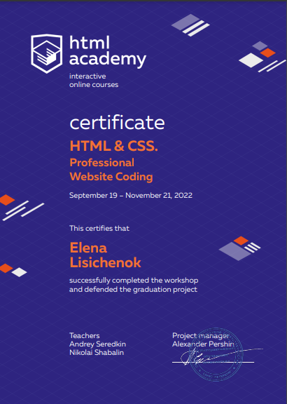

# Elena Lisichenok

## Junior Frontend Developer

### Contacts

**Phone:** +7 (952) 207 52 66


**E-mail:** elisichenok@gmail.com


**Telegram:** @panilisica


**Discord:** elena-lis


==========


### Personal Statement

Being a certified historian, I worked for eight years in the field of culture, but decided to become a front-end developer, since this profession involves continuous self-improvement and involvement in the world of modern technologies.


I started my acquaintance with HTML, CSS and JavaScript with code-simulators, but the magic of code writing quickly fascinated me, so I started studying web development at one of the well-known online schools. Here I completed several training projects, developed skills and work speed, worked in a team in conditions close to real development.


I like challenging problems because solving them inspires me to develop further.


==========


### Skills

* HTML5, CSS3
* Sass
* JavaScript/ES6 Basics
* Git, GitHub
* VS Code
* Figma
* Gulp Basics


==========


### Code Example


**Find the missing element between two arrays:** *given two integer arrays where the second array is a shuffled duplicate of the first array with one element missing, find the missing element.*

```
function findMissing(arr1, arr2) {
  let dictionary = {};
  arr1.forEach((element) => (element in dictionary) ? dictionary[element] += 1 : dictionary[element] = 1);
  arr2.forEach((element) => (element in dictionary) ? dictionary[element] -= 1 : dictionary[element] = 1);
  for (let key in dictionary) {
    if (dictionary[key] > 0) return +key;
  }
}
```

==========


### Education


**«HTML Academy» Courses:**

* **HTML & CSS. Professional Website Coding**

    _September 19 — November 21, 2022_

    


* **HTML & CSS. Adaptive Website Coding and Automation**

    _November 21, 2022 — January 30, 2023_

    


* **Java Script. Professional Development of Web Interfaces**

    _February 14 — April 17, 2023_


==========


### Work Experience

* **Development Stage during the study at the «HTML Academy»**

    _June 06 — September 25, 2023_

    + **[Personal Project «Drink2Go»](https://lena-lis.github.io/Drink2Go/build/)**

    __About:__ Drink2Go is an online store selling coffee drinks. Convenient sorting by country of grain growth and milk concentration will help you choose the perfect drink. The number of items to order is not limited.

    The goal of the task was to independently fulfill the maximum number of requirements for a limited period (a week).


    __Tools & Approaches Used:__ HTML, SCSS, Gulp, BEM, Mobile First, noUiSlider, Swiper


    + **[Personal Project «Fitness 2.0»](https://lena-lis.github.io/fitness_2.0/build/)**

    __About:__ The project was completed during the acceleration stage at the «HTML Academy» on the «Frontend Developer Profession» in a team with a manager, mentor and testers.


    __Tools & Approaches Used:__ HTML, SCSS, Gulp, BEM, Desktop First, Cross-browser compatibility, initialization of the video player with JS, Tabs & Accordions, Swiper

    
    + **[Personal Project «Lifetour»](https://lena-lis.github.io/travels/build/)**

    __About:__ The project was completed during the acceleration stage at the «HTML Academy» on the «Frontend Developer Profession» in a team with a manager, mentor and testers.


    __Tools & Approaches Used:__ HTML, SCSS, Gulp, BEM, Desktop First, Cross-browser compatibility, initialization of the video and audio players with JS, Tabs & Accordions, Swiper, Leaflet


==========


### Languages


* English — Proficient (according to the 50-min online test at [EF Set](https://www.efset.org/ef-set-50/))


[](https://www.efset.org/cert/a34Ldx)
* Russian — Native
* Polish — Upper Intermediate
